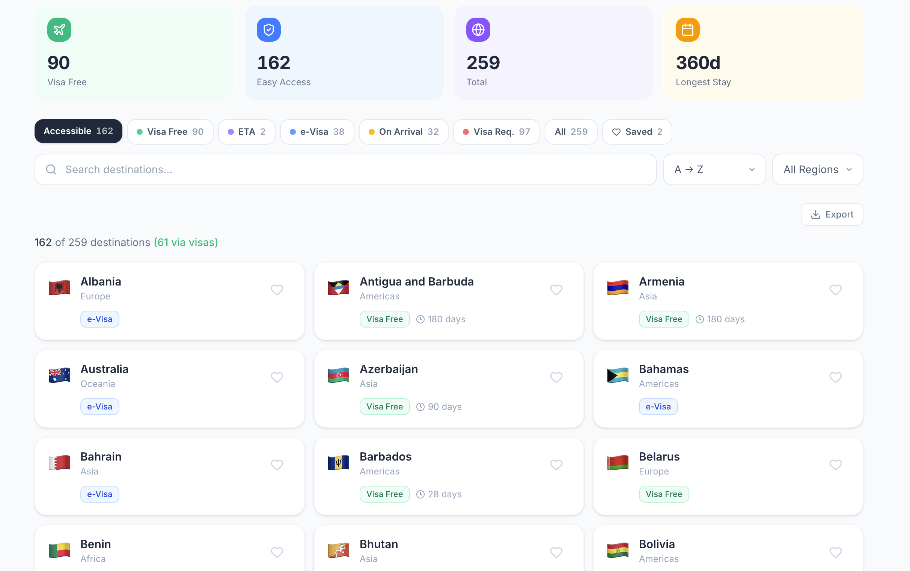
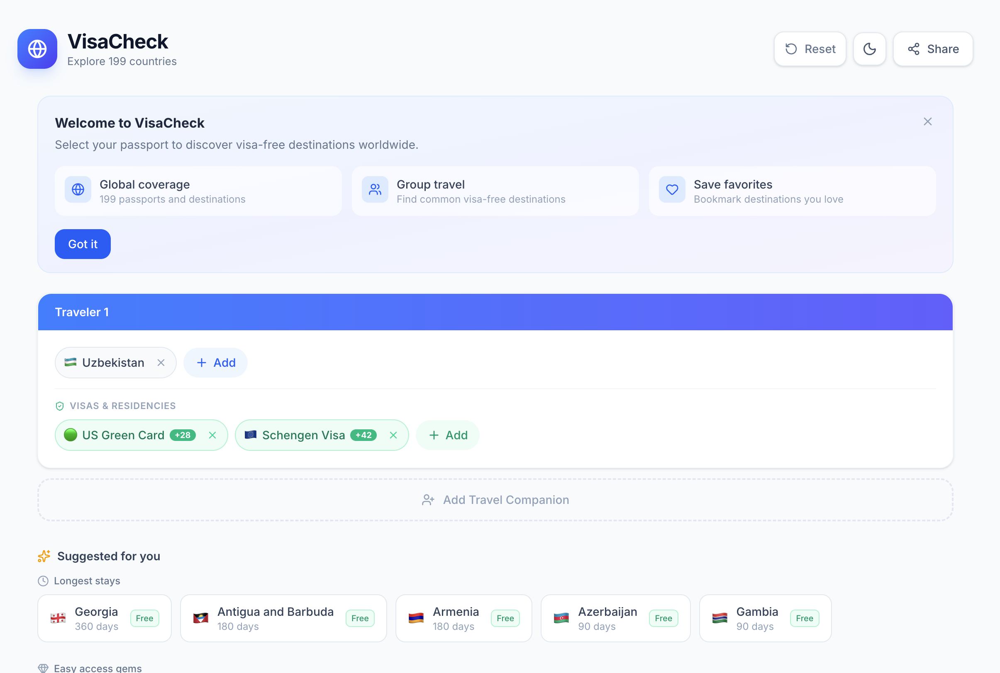
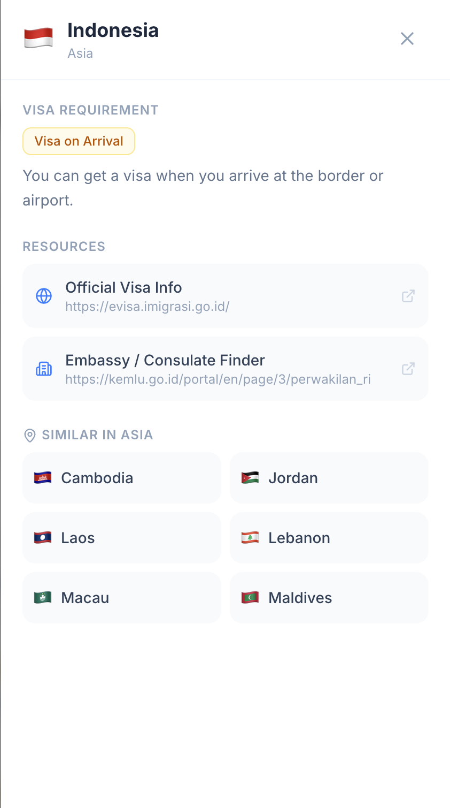
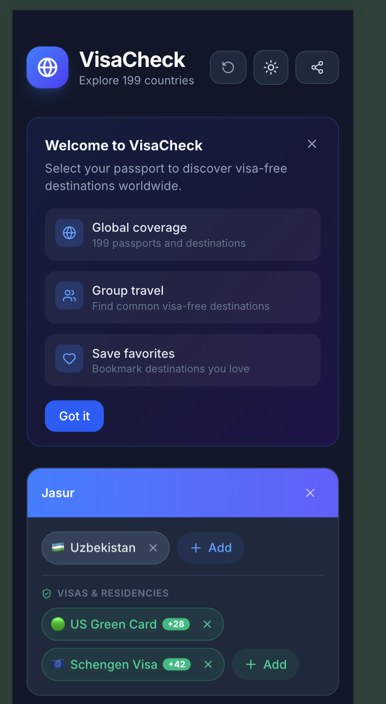
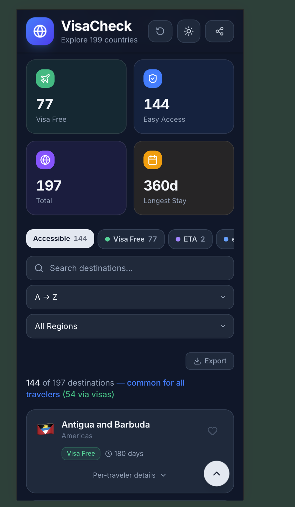
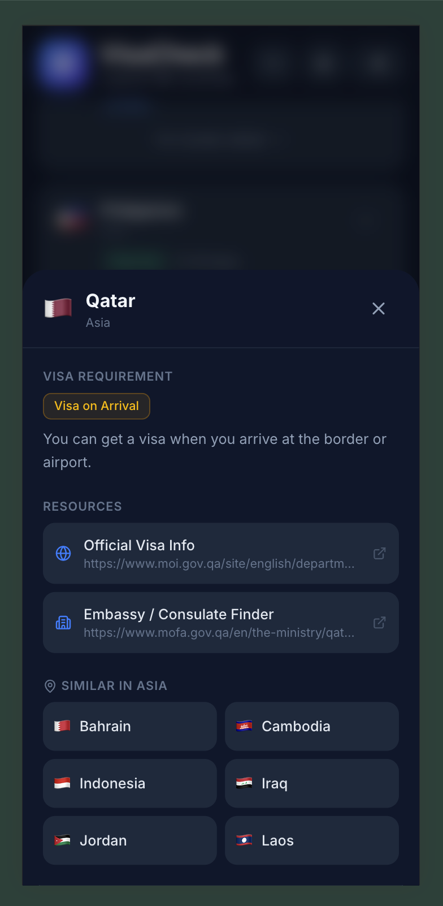
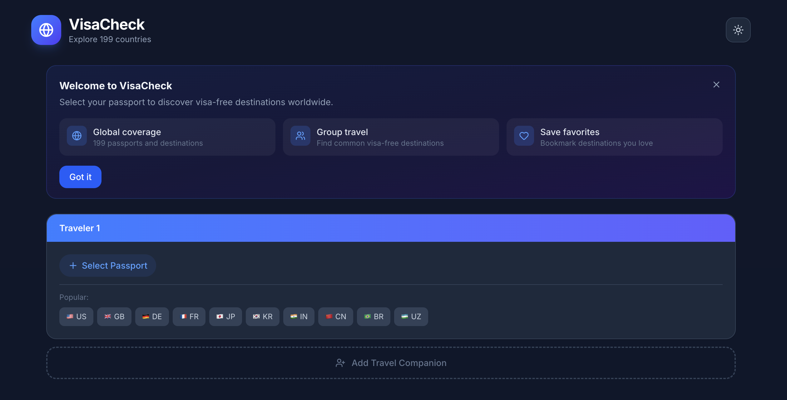

<p align="center">
  
  
  
  
  
</p>

# VisaCheck

**Discover where you can travel, together.** VisaCheck is a modern, open source visa requirements checker that helps solo travelers and groups instantly see which countries they can visit based on their passports, visas, and residency permits.

> 🌐 **Live Demo:** [jasur-2902.github.io/Passport-Power-Index-Visa-Checker](https://jasur-2902.github.io/Passport-Power-Index-Visa-Checker/)

<p align="center">
  
</p>

## Why VisaCheck?

Planning international travel is complicated. When you hold multiple passports, have a US Green Card, or travel with a partner from a different country, figuring out where **everyone** can go becomes a real headache. VisaCheck solves this by:

| Problem | Solution |
|---------|----------|
| Scattered visa information across dozens of websites | All 199 countries in one place with instant filtering |
| No tool considers your visas and residency permits | Add your Green Card, Schengen Visa, or GCC Residence to unlock bonus destinations |
| Couples and groups can't find common destinations | Group travel mode finds where **all** travelers can go together |
| Most tools don't work well on phones | Fully responsive with mobile bottom sheets and touch optimized UI |

## Screenshots

### Desktop Experience

<table>
  <tr>
    <td width="50%">
      
      <p align="center"><em>Welcome screen (Dark Mode)</em></p>
    </td>
    <td width="50%">
      
      <p align="center"><em>Results grid with stats, filters, and search</em></p>
    </td>
  </tr>
  <tr>
    <td width="50%">
      
      <p align="center"><em>Group travel: two travelers with different passports</em></p>
    </td>
    <td width="50%">
      
      <p align="center"><em>Country detail: visa info, official links, similar countries</em></p>
    </td>
  </tr>
</table>

### Mobile Experience

<table>
  <tr>
    <td width="33%">
      
      <p align="center"><em>Mobile passport setup</em></p>
    </td>
    <td width="33%">
      
      <p align="center"><em>Mobile results and stats</em></p>
    </td>
    <td width="33%">
      
      <p align="center"><em>Mobile country detail sheet</em></p>
    </td>
  </tr>
</table>

## Features

### 🛂 Passport Power Index
Select one or more passports per traveler to instantly see visa requirements for 199 countries. Results are categorized into: Visa Free, ETA, e-Visa, Visa on Arrival, Visa Required, and No Admission.

### 🪪 Visa & Residency Benefits
Go beyond passports. Add your US Green Card, Schengen Visa, UK BRP, UAE Residence, APEC Card, and more. VisaCheck calculates **bonus destinations** unlocked by each holding, showing exactly how many new countries each visa opens up with a `+N` badge.

### 👫 Group Travel Mode
Add multiple travelers, each with their own passports and visas. VisaCheck finds destinations where **everyone** can go, using worst case logic (if one person needs a visa, the group result shows "visa required").

### 📊 Smart Stats & Suggestions
Summary cards show your Visa Free count, Easy Access count, Total destinations, and Longest Stay at a glance. The "Suggested for you" section highlights longest stays, easy access gems, and popular picks.

### 🔍 Advanced Filtering & Search
Filter by visa category, search by country name, sort alphabetically or by stay duration, and filter by region (Asia, Europe, Americas, Africa, Oceania). Export results as CSV or copy a shareable link.

### 🌙 Dark Mode
Full dark mode support with automatic system preference detection and manual toggle. Every component is styled for both themes.

### 📱 Responsive Design
Mobile first design with bottom sheet dropdowns, touch optimized cards, horizontally scrollable filter pills, and adaptive layouts that work from 320px phones to ultrawide monitors.

### ❤️ Favorites & Bookmarks
Save destinations you love with a heart button. Filter to see only your saved countries across sessions using localStorage persistence.

### 🔗 Shareable URLs
Share your exact configuration (passports, visas, favorites) via URL. Recipients see the same results without any setup.

### ⌨️ Keyboard Shortcuts
Power user shortcuts: `/` to search, `Escape` to close panels, arrow keys for dropdown navigation, `Enter` to select.

## Architecture

```
┌─────────────────────────────────────────────────────────────┐
│                        App.tsx                              │
│                   (State & Orchestration)                   │
│                                                             │
│  ┌──────────────┐  ┌──────────────┐  ┌──────────────────┐   │
│  │   Travelers   │  │   Favorites  │  │   Share URL      │   │
│  │   useState()  │  │ useFavorites │  │  useShareUrl()   │   │
│  └──────┬───────┘  └──────┬───────┘  └──────────────────┘   │
│         │                 │                                  │
│         ▼                 ▼                                  │
│  ┌─────────────────────────────────────────────────────┐    │
│  │              useMemo: Visa Computation              │    │
│  │                                                     │    │
│  │  getVisaResults() ──► getGroupResults()             │    │
│  │         │                    │                      │    │
│  │         ▼                    ▼                      │    │
│  │  getVisaBenefitResults()   Merge & Categorize       │    │
│  └─────────────────────────────────────────────────────┘    │
│                          │                                   │
│              ┌───────────┼───────────┐                      │
│              ▼           ▼           ▼                      │
│     ┌────────────┐ ┌──────────┐ ┌───────────┐              │
│     │ StatsBar   │ │ Results  │ │ Suggestions│              │
│     │ + Filters  │ │  View    │ │   Cards    │              │
│     └────────────┘ └────┬─────┘ └───────────┘              │
│                         │                                    │
│                         ▼                                    │
│              ┌───────────────────┐                          │
│              │ DestinationModal  │                          │
│              │ (Country Details) │                          │
│              └───────────────────┘                          │
└─────────────────────────────────────────────────────────────┘
```

### Data Flow

```
┌────────────────┐     ┌──────────────────┐     ┌──────────────────┐
│  Static JSON   │     │   visaUtils.ts   │     │ visaBenefits.ts  │
│  199 countries │────►│                  │     │                  │
│  visa matrix   │     │ categorize()     │     │ 13 visa types    │
└────────────────┘     │ getVisaResults() │     │ 200+ benefit     │
                       │ getGroupResults()│     │ entries          │
                       │                  │◄────│                  │
                       │ Memoized with    │     │ getVisaBenefit   │
                       │ Map caches       │     │ Results()        │
                       └──────────────────┘     └──────────────────┘
```

### Component Structure

```
App.tsx
├── Header.tsx                 Logo, reset, dark mode toggle, share
├── WelcomeBanner.tsx          First visit onboarding
├── PassportSelector.tsx       Traveler cards with passport & visa pickers
│   └── VisaSection            Per traveler visa/residency management
├── DestinationSuggestions.tsx  Longest stays, easy gems, popular picks
├── SummaryCards.tsx            Visa Free / Easy Access / Total / Longest Stay
├── StatsBar.tsx               Category filter pills, search, sort, region
├── PassportCompare.tsx        Side by side passport comparison table
├── ResultsView.tsx            Country cards grid with expandable details
│   └── DestinationModal.tsx   Slide in panel with resources & similar countries
├── ExportButton.tsx           CSV export and clipboard copy
└── KeyboardShortcuts.tsx      Shortcut reference modal
```

## Tech Stack

| Layer | Technology | Purpose |
|-------|-----------|---------|
| **Framework** | React 19.2 | UI components with hooks |
| **Language** | TypeScript 5.9 | Type safety across the codebase |
| **Styling** | Tailwind CSS 4.1 | Utility first CSS with custom theme tokens |
| **Build** | Vite 7.3 | Fast dev server and optimized production builds |
| **Icons** | Lucide React | Consistent, tree shakable icon set |
| **Hosting** | GitHub Pages | Free static hosting via GitHub Actions |

### Performance Optimizations

| Technique | Where | Impact |
|-----------|-------|--------|
| **Function level memoization** | `getVisaResults()`, `getGroupResults()` | Map based caches prevent recomputation for same passport codes |
| **React useMemo** | App.tsx visa computation pipeline | Only recalculates when passport/visa data changes, not on name edits |
| **Code splitting** | Vite `manualChunks` config | Separates vendor (React), data (visa JSON), and app code into parallel loaded chunks |
| **Portal based dropdowns** | PassportSelector.tsx | Avoids stacking context issues; uses `getBoundingClientRect` for anchored positioning |
| **Virtual scrolling limit** | Country search dropdown | Caps at 50 visible items to keep DOM lightweight |

## Getting Started

### Prerequisites

| Tool | Version |
|------|---------|
| Node.js | 18 or higher |
| npm | 9 or higher |

### Installation

```bash
git clone https://github.com/jasur-2902/Passport-Power-Index-Visa-Checker.git
cd Passport-Power-Index-Visa-Checker
npm install
```

### Development

```bash
npm run dev
```

Opens at `http://localhost:5173` with hot module replacement.

### Production Build

```bash
npm run build
npm run preview
```

### Linting

```bash
npm run lint
```

## Project Structure

```
src/
├── App.tsx                        Main application component and state management
├── main.tsx                       React entry point
├── index.css                      Global styles, dark mode, animations, design tokens
├── components/
│   ├── PassportSelector.tsx       Traveler cards, passport/visa search dropdowns
│   ├── ResultsView.tsx            Country cards grid with category badges
│   ├── StatsBar.tsx               Filter pills, search input, sort/region selects
│   ├── SummaryCards.tsx            Stats overview (visa free, easy access, total)
│   ├── DestinationModal.tsx       Country detail slide in panel
│   ├── DestinationSuggestions.tsx  Smart recommendation carousels
│   ├── PassportCompare.tsx        Two passport comparison table
│   ├── ExportButton.tsx           CSV and clipboard export
│   ├── Header.tsx                 App header with controls
│   ├── WelcomeBanner.tsx          Onboarding banner for first time users
│   └── KeyboardShortcuts.tsx      Keyboard shortcut reference
├── data/
│   ├── visa-requirements.json     199×199 visa requirements matrix
│   ├── countries.ts               Country metadata (name, code, flag, region)
│   ├── visaUtils.ts               Visa categorization, caching, group logic
│   ├── visaBenefits.ts            Visa/residency benefits database (200+ entries)
│   └── officialLinks.ts           Government visa and embassy URLs for 50+ countries
└── hooks/
    ├── useFavorites.ts            localStorage backed favorites management
    ├── useVisaHoldings.ts         Visa holding state management
    └── useShareUrl.ts             URL encoding/decoding for shareable links
```

## Visa Benefits Database

VisaCheck includes a curated database of visa and residency benefits covering:

| Holding Type | Examples | Destinations Unlocked |
|-------------|----------|----------------------|
| **US Green Card** | Lawful Permanent Resident | 35+ countries including Mexico, Canada, Georgia, Turkey |
| **US Visa** | B1/B2, F1, H1B | 20+ countries including Mexico, Panama, Albania |
| **Schengen Visa** | Type C short stay | 29 Schengen states + 10 third countries |
| **EU Residence** | Any Schengen member permit | 29 Schengen states + 12 third countries |
| **UK Visa/BRP** | Biometric Residence Permit | 18+ countries including Mexico, Turkey, Georgia |
| **Canada PR** | Permanent Resident card | 15+ countries |
| **UAE Residence** | Residence visa/permit | 13+ countries including Turkey, GCC states |
| **APEC Card** | Business Travel Card | 19 APEC member economies |

All data includes confidence levels (high/medium) and specific conditions for each benefit.

## Deployment

The app auto deploys to GitHub Pages on every push to `main` using the included GitHub Actions workflow at `.github/workflows/deploy.yml`.

```
Push to main ──► GitHub Actions ──► npm ci ──► npm run build ──► Deploy to Pages
```

## Contributing

Contributions are welcome! Some areas where help is appreciated:

1. **Data accuracy**: Verify visa requirements against official sources
2. **New visa benefits**: Add more visa/residency types and their associated benefits
3. **Official links**: Add government visa and embassy URLs for more countries
4. **Accessibility**: Improve screen reader support and keyboard navigation
5. **Localization**: Add support for multiple languages

## License

This project is open source and available under the [MIT License](LICENSE).

## Acknowledgments

Made with ❤️ for Morgan — so she always knows where we can travel together.
